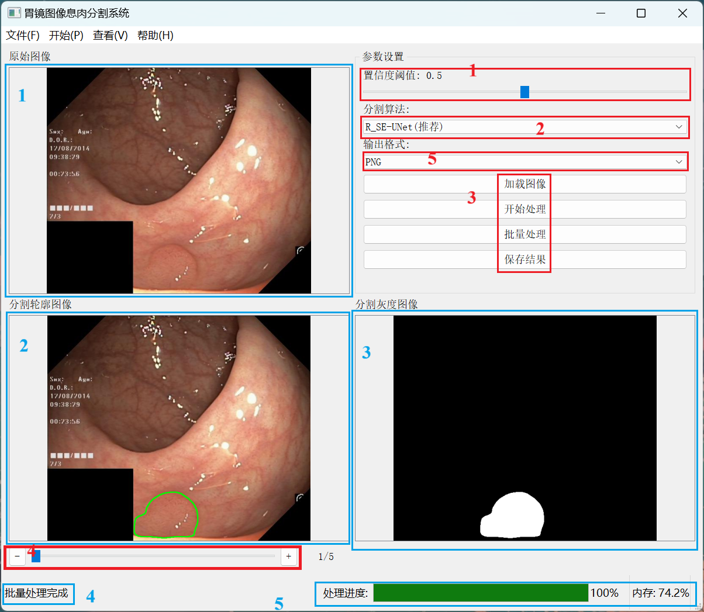

# 胃镜图像息肉分割项目

## 项目简介和特点
本项目基于改进的U-Net架构（结合ResNet50和CBAM、SE、ECA三种注意力模块），用于胃镜图像中的息肉分割任务。主要特点包括：
- 使用ResNet50作为编码器，提取深层特征
- 引入注意力机制，增强特征表达能力
- 创新设计置信度加权混合损失函数，增强模型性能
- 支持多种评估指标计算（Dice, IoU, PA,Precision, 等）
- 提供完整的训练、测试和可视化流程
- 包含形态学后处理模块，优化分割结果
- 制作图形化分割系统，方便用户交互

## 目录
1. [环境配置要求](#一环境配置要求)
   - [直接依赖列表](#直接依赖列表)
   - [环境配置方法](#环境配置方法)
2. [项目结构说明](#二项目结构说明)
3. [重要参数说明](#三重要参数说明)
   - [训练参数](#训练参数)
   - [测试参数](#测试参数)
   - [输出轮廓图像参数](#输出轮廓图像参数)
4. [输出结果说明](#四输出结果说明)
   - [训练过程输出](#训练过程输出)
   - [测试过程输出](#测试过程输出)
5. [UI界面功能说明](#五ui界面功能说明)
   - [主界面布局](#主界面布局)
   - [主要功能](#主要功能)
   - [操作快捷键](#操作快捷键)
6. [注意事项](#六注意事项)
   - [数据准备](#数据准备)
   - [模型训练](#模型训练)
   - [测试要求](#测试要求)
7. [作者信息](#作者信息)
8. [版权声明](#版权声明)

## 一、环境配置要求
### 直接依赖列表
- 核心框架
  - torch==2.6.0+cu126
  - torchvision==0.21.0+cu126  
  - torchaudio==2.6.0+cu126
  - onnxruntime==1.19.2
  - protobuf==6.30.2

- 图像处理
  - opencv-python==4.11.0.86
  - pillow==11.2.1
  - scikit-image==0.24.0
  - tifffile==2024.8.30
  - imageio==2.37.0
  - imgviz==1.7.6

- 科学计算  
  - numpy==1.26.3
  - scipy==1.13.1
  - pandas==1.5.3
  - sympy==1.13.1
  - mpmath==1.3.0

- 机器学习
  - scikit-learn==1.6.1
  - matplotlib==3.9.4
  - seaborn==0.13.2
  - plotly==6.0.0
  - torchviz==0.0.3

- 数据处理
  - tqdm==4.67.1  
  - natsort==8.4.0
  - networkx==3.2.1
  - flatbuffers==25.2.10

- 医学图像专用
  - nibabel==5.3.2
  - pydicom==2.4.4
  - contourpy==1.3.0

- 工具库
  - requests==2.32.3
  - pyyaml==6.0.2
  - psutil==5.9.0
  - loguru==0.7.3
  - humanfriendly==10.0
  - coloredlogs==15.0.1
  - gdown==5.2.0

- 图形界面
  - pyqt5==5.15.11
  - pyqt5-sip==12.17.0
  - pyside6==6.9.0
  - pyinstaller==6.13.0
  - pyinstaller-hooks-contrib==2025.4

- 系统工具
  - filelock==3.13.1
  - win32_setctime==1.2.0
  - pywin32-ctypes==0.2.3
  - zipp==3.21.0
  - typing_extensions==4.12.2

- 开发工具
  - jinja2==3.1.4
  - markupsafe==2.1.5
  - packaging==24.2
  - pefile==2023.2.7
  - altgraph==0.17.4

- 系统依赖
  - cuda-toolkit==12.1 (通过conda安装)
  - cudnn==8.9.2 (通过conda安装)

### 环境配置方法
- 环境配置详情见文件：
[environment.yml](./environment.yml)（点击查看完整依赖列表）

- 安装准备：

| 工具/组件 | 推荐版本 | 官方下载链接 |
|----------|---------|------------|
| Python | 3.9.x | [Python官网](https://www.python.org/downloads/) |
| Conda | 最新版 | [Anaconda官网](https://www.anaconda.com/download) |
| CUDA Toolkit | 12.1 | [NVIDIA CUDA](https://developer.nvidia.com/cuda-downloads) |
| cuDNN | 8.9.2 | [NVIDIA cuDNN](https://developer.nvidia.com/cudnn) |

- 创建环境：
```bash
conda env create -f environment.yml               # 创建环境  
conda env update --file environment.yml --prune   # 更新环境
conda activate unetg2                             # 激活环境
```
注意：PyTorch相关包(如torch、torchvision)需要根据您的CUDA版本进行调整。

- 显卡兼容性检查 ：
```bash
python -c "import torch; print(torch.cuda.is_available())"  # 检查CUDA是否可用
print(torch.version.cuda)       # CUDA版本
```
- 检查显卡驱动：
```bash
nvidia-smi  # 查看驱动版本和CUDA版本
```
- 验证CUDA工具包：
```bash
nvcc --version  # 检查CUDA工具包
```
- 如果遇到CUDA不匹配，可以重新安装匹配的PyTorch：
```bash
# 先卸载现有torch
pip uninstall torch
# 重新安装指定版本（网上查询），如：
pip install torch==2.6.0+cu126 --extra-index-url https://download.pytorch.org/whl/cu126
#或使用CPU版本
  #1. 通过conda安装（推荐）
conda install pytorch torchvision torchaudio cpuonly -c pytorch
  #2. 通过pip安装
pip install torch torchvision torchaudio --index-url https://download.pytorch.org/whl/cpu
```

## 二、项目结构说明
```text
├── model/                         # 模型定义
│   ├── unet_model.py              # 主模型架构
│   ├── cbam/se/eca.py             # CBAM/SE/ECA模块实现
│   └── unet_parts.py              # UNet组件
├── utils/                         # 工具函数
│   ├── dataset.py                 # 数据加载
│   ├── utils_metrics.py           # 评估指标
│   └── morphology.py              # 形态学后处理
├── ui/                            # 图形化界面
│   ├── icon.ico                   # 图标资源
│   ├── polyp_segmentation_ui.py   # 主界面实现
│   └── resource_loader.py         # 资源路径处理
├── build_exe.py                   # 打包工具
├── train.py                       # BCE+Dice混合损失函数训练脚本
├── train_WLoss.py                 # 置信度加权混合损失函数训练脚本
├── test.py                        # 测试脚本
├── model_visualization.py         # 模型可视化
└── environment.yml                # 详细环境配置
└── README.md                      # 帮助文档
```

## 三、重要参数说明
### 训练参数
```python
# train.py 和 train_WLoss.py 中的关键参数
EPOCHS = 50               # 训练轮数
BATCH_SIZE = 4            # 批次大小
LR = 3e-4                 # 初始学习率
min_lr=1e-6               # 最小学习率
WEIGHT_DECAY = 1e-5       # 权重衰减
ALPHA = 0.5               # 混合损失权重(BCE+Dice)
```
### 测试参数
```python
# test.py 中的关键参数
MIOU_MODE = 0             # 0:完整流程 1:仅预测 2:仅计算指标
NUM_CLASSES = 2           # 类别数(背景+息肉)
MAX_REGIONS = 2           # 后处理保留的最大区域数
MIN_AREA_RATIO = 0.012    # 最小区域面积比例阈值
```
### 输出轮廓图像参数
```python
THRESHOLD = 0.5               # 分割阈值
CONTOUR_COLOR = (0, 255, 0)   # 轮廓线颜色(BGR)
LINE_WIDTH = 2                # 轮廓线宽度
```
## 四、输出结果说明
### 训练过程输出
- **训练日志**：实时显示损失函数值、学习率等指标

- **模型权重**：自动保存为`best_model*.pth`文件

- **损失曲线**：记录在`train_val_loss_curve.png`

### 测试过程输出
- **训练日志**：显示Dice、IoU、PA、Precision指标，并计算PR曲线面积AP

- **图表输出**：

```text
results/
├── PR_Curve.png               # PR曲线图
├── confusion_matrix.csv       # 混淆矩阵数据
├── Metrics_Radar_Chart.png    # 评估指标汇总雷达图
└── Dice_Coefficient.png       # Dice系数可视化图
└── mIoU_Score.png             # mIoU可视化图
└── mPA_Recall.png             # mPA和Recall可视化图
└── Rrecision.png              # Precision可视化图
```
- **结果输出**：

```text
data/results/
├── pred_prob/            # 预测概率图(0-255灰度值)
├── pred_gray/            # 二值分割图
└── pred_record/          # 带轮廓的原图可视化
```
## 五、UI界面功能说明
### 主界面布局
- **主界面展示**：  

- **左上区域**：原始图像显示区，支持拖放加载图像
- **右上区域**：参数设置面板，包含：
  - 置信度阈值调节滑块
  - 算法选择下拉框
  - 输出格式选择
  - 操作按钮（加载/处理/保存等）
- **左下区域**：分割轮廓图像显示区
- **右下区域**：分割灰度图像显示区

### 主要功能
1. **图像加载**：
   - 支持单张图像加载（文件菜单或拖放）
   - 支持批量处理整个文件夹图像

2. **图像处理**：
   - 提供5种分割算法选择
   - 实时显示处理进度
   - 支持置信度阈值调整

3. **结果展示**：
   - 三视图同步显示（原始/轮廓/分割图）

4. **主题切换**：
   - 白天/夜间模式一键切换
   - 自适应图像显示区域背景

5. **批量处理**：
   - 自动处理文件夹内所有支持格式的图像
   - 通过滑动条快速浏览处理结果

### 操作快捷键
- `Ctrl+O`：加载图像
- `Ctrl+S`：保存结果  
- `Ctrl+D`：开始处理
- `Ctrl+F`：批量处理
- `Ctrl+X`：清除图像
- `Ctrl+L`：白天模式
- `Ctrl+B`：夜间模式

## 六、注意事项
### 数据准备
  - 图像格式：`JPG`
  - 标签格式：单通道`PNG` (0:背景, 255:息肉)
  - 目录结构需保持一致：

    ```text
    ├── data/                          # 数据集目录
    │   ├── results/                   # 输出结果
    │   ├── Training_Images/           # 训练图像
    │   ├── Training_Labels/           # 训练标签
    │   ├── Val_Images/                # 验证图像
    │   ├── Val_Labels/                # 验证标签
    │   ├── Test_Images/               # 测试图像
    │   └── Test_Labels/               # 测试标签
    ```

### 模型训练
  - 默认使用`AdamW`优化器
  - 包含学习率衰减策略
  - 最佳模型根据验证集最佳损失自动保存为`best_model.pth`

### 测试要求
  - 测试图像应放在对应目录
  - 需提供对应的标签图像
  - 测试前请确认模型权重路径正确

## 作者信息
**作者**：任威名  
**单位**：天津大学生物医学工程系  
**邮箱**：[renweiming@tju.edu.cn](mailto:renweiming@tju.edu.cn)    
**日期**：2025年5月30日

## 版权声明
版权所有 © 2025 任威名，天津大学生物医学工程系  
本软件遵循 [MIT 许可证](https://opensource.org/licenses/MIT) 发布，详情请参阅项目根目录下的 [LICENSE](./LICENSE) 文件。

*使用说明：本代码仅供学习和研究使用，禁止用于商业用途。引用本项目时请注明作者信息。*


